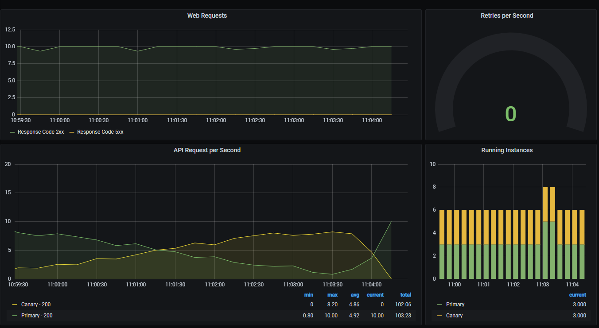

# Automated Kubernetes Deployments with Flagger and Consul

Blah blah two teir application

## Setup

To setup the required software for this example please follow one of the following guides:

* [Manual Setup](./manual_setup/README.md)
* [GKE Terraform](./terraform/README.md)
* [Local Setup with Docker](./shipyard/README.md)


## Configuring the application

After installing the cluster and required software you can then install the application. To run the canary deployment demo
you need to configure the following components:

* Consul CRDs for Service Mesh
* Flagger configuration
* Grafana Dashboard
* Load generator
* Application Deployment

### Consul CRDs for Service Mesh

Flagger will controll the traffic splitting however for this to work additional configuration needs to be added 
to Consul.

#### ServiceDefaults

First are the `ServiceDefaults`, this configuration informs Consul that the services `web` and `api` are 
`HTTP` services. Setting the protocol for the service changes the way that the service mesh emits metrics.
Using the HTTP protocol we will be able to see metrics related to the HTTP requests and responses including status codes.
Flagger uses this information to determine the health of a canary.

```yaml
---
apiVersion: consul.hashicorp.com/v1alpha1
kind: ServiceDefaults
metadata:
  name: web
spec:
  protocol: http

---
apiVersion: consul.hashicorp.com/v1alpha1
kind: ServiceDefaults
metadata:
  name: api
spec:
  protocol: http
```

#### ServiceRouter

Next we need to configure the `ServiceRouter`, the `ServiceRouter` allows you to
set configuration such as retries for a service. Retries are essential when 
running canary deployments as they protect the end user in the instance that the deployed 
canary is faulty.

```yaml
---
apiVersion: consul.hashicorp.com/v1alpha1
kind: ServiceRouter
metadata:
  name: api
spec:
  routes:
  - destination:
      service: "api"
      numRetries: 3
      retryOnStatusCodes: [500, 503]
```

Lastly you need to confiugre the `ServiceResolver`, a `ServiceResolver` allows a
virtual subsets of a Consul service to be defined. These subsets are configured to 
direct traffic to the `Primary` or the currently deployed service, and the `Canary`
version of the service.  

The `TrafficSplitter` which is automatically configured Flagger uses the subsets defined in
in the `ServiceResolver` to split traffic between the two versions.   The configuration for 
this is based on Consul's filter options: https://www.consul.io/api-docs/health#filtering-2 

When Flagger takes control of your Pod it appends `primary` to the name, and since the ID  
of the service in Consul is the Pod name we can use this to create the subsets.

```yaml
---
apiVersion: consul.hashicorp.com/v1alpha1
kind: ServiceResolver
metadata:
  name: api
spec:
  defaultSubset: api-primary
  subsets:
    api-primary:
      filter: "Service.ID contains \"api-primary\""
      onlyPassing: true
    api-canary:
      filter: "Service.ID not contains \"api-primary\""
      onlyPassing: true
```

### Flagger configuration

To allow `Flagger` to control the deployment process you need to configure it. There are two resources that
need to be created a `MetricTemplate` to define the Prometheus query to get the health of the deployment, and 
a `Canary` resource which defines the actual Flagger config.

#### MetricTemplate

The `MetricTemplate` defines the query that Flagger will use to check the health of the Canary. The following
query gets the number of succesful requests, divides it by the total requests to return the sucess percentage
and then multiplies this by 100.

```yaml
---
apiVersion: flagger.app/v1beta1
kind: MetricTemplate
metadata:
  name: consul-requests
  namespace: default
spec:
  provider:
    type: prometheus
    address: http://prometheus-kube-prometheus-prometheus.default.svc:9090
  query: |
    sum(
      rate(
        envoy_cluster_upstream_rq{
          namespace="{{ namespace }}",
          pod=~"{{ target }}-[0-9a-zA-Z]+(-[0-9a-zA-Z]+)",
          envoy_cluster_name="local_app",
          envoy_response_code!~"5.*"
        }[{{ interval }}]
      )
    )
    /
    sum(
      rate(
        envoy_cluster_upstream_rq{
          namespace="{{ namespace }}",
          envoy_cluster_name="local_app",
          pod=~"{{ target }}-[0-9a-zA-Z]+(-[0-9a-zA-Z]+)"
        }[{{ interval }}]
      )
    )
    * 100
```

#### Canary

Next you configure the `Canary`, the `Canary` resource defines the deployment that Flagger will control
and the parameters for the roll out. In the `analysis` section of the following resouce definition, you can
see these parameters. The definition tells flagger that you would like to increase the traffic sent to the canary 
by 10% when the success rate is 99% or greater.

```yaml
---
apiVersion: flagger.app/v1beta1
kind: Canary
metadata:
  name: api
  namespace: default
spec:
  provider: linkerd
  # deployment reference
  targetRef:
    apiVersion: apps/v1
    kind: Deployment
    name: api
  # the maximum time in seconds for the canary deployment
  # to make progress before it is rollback (default 600s)
  progressDeadlineSeconds: 60
  service:
    # ClusterIP port number
    port: 9090
    # container port number or name (optional)
    targetPort: 9090
  analysis:
    # schedule interval (default 60s)
    interval: 30s
    # max number of failed metric checks before rollback
    threshold: 5
    # max traffic percentage routed to canary
    # percentage (0-100)
    maxWeight: 80
    # canary increment step
    # percentage (0-100)
    stepWeight: 10
    # Linkerd Prometheus checks
    metrics:
    - name: "consul-requests"
      templateRef:
        name: consul-requests
        # namespace is optional
        # when not specified, the canary namespace will be used
        namespace: default
      # minimum req success rate (non 5xx responses)
      # percentage (0-100)
      thresholdRange:
        min: 99
      interval: 1m
```

### Grafana dashboard

While not necessary for the operation of the Canary a simple dashboard provides you with information
related to your application. The dashboard shows simple information such as the number of requests and 
status codes for the `web` service along with detailed request information on the `api`.



If you are using either the local, the GCP, or the manual setup environments then Grafana has been
configured to use sidecar dashboards. This allows you to load a dashboard using a `Config` map that 
has the annotation `grafana_dashboard: "1"`.

```yaml
---
apiVersion: v1
kind: ConfigMap
metadata:
  name: canary-dashboard
  labels:
     grafana_dashboard: "1"
data:
  canary.json: |
    {
      "annotations": {
        "list": [
          {
            "builtIn": 1,
            "datasource": "-- Grafana --",
            "enable": true,
            "hide": true,
            "iconColor": "rgba(0, 211, 255, 1)",
            "name": "Annotations & Alerts",
            "type": "dashboard"
          }
```

### Load Generation

To simulate load on the system and to reduce repetitive stran injuries from pressing refresh in your browser a simple
10 concurrent user load generator has been configured using [K6](https://k6.io/). The load test calls the web
endpoint which in turn calls the api.

### Application configuration

Finally you configure your application.

#### Web application

The `web` application is the public endpoint, it has an upstream service `api` which we are deploying our canary too.

This application is a plain Kubernetes deployment, with added annotations so that Consul will inject the required sidecars
and configure it to be part of the service mesh. Consul has a mutating web hook controller which looks for pods and deployments 
that have the annotation `"consul.hashicorp.com/connect-inject": "true"`. When it finds this annotation it automatically
adds the Envoy sidecar needed by the service mesh.

To communicate with the upstream you define the required service as an
annotation `"consul.hashicorp.com/connect-service-upstreams": "api:9091"` which makes the Consul service `api` available
at `localhost:9091`. The service mesh handles the actual routing of the traffic, including the retries and traffic splitting.

This deployment uses the tool `fake-service` to simulate a JSON API which calls the `api` upstream.

```yaml
---
# Web frontend
apiVersion: apps/v1
kind: Deployment
metadata:
  name: web-deployment
  labels:
    app: web
spec:
  replicas: 1
  selector:
    matchLabels:
      app: web
  template:
    metadata:
      labels:
        app: web
        metrics: enabled
      annotations:
        "consul.hashicorp.com/connect-inject": "true"
        "consul.hashicorp.com/service-tags": "v1"
        "consul.hashicorp.com/connect-service-upstreams": "api:9091"
    spec:
      containers:
      - name: web
        image: nicholasjackson/fake-service:v0.20.0
        ports:
        - containerPort: 9090
        env:
        - name: "LISTEN_ADDR"
          value: "0.0.0.0:9090"
        - name: "UPSTREAM_URIS"
          value: "http://localhost:9091"
        - name: "NAME"
          value: "web"
        - name: "MESSAGE"
          value: "Hello World"
        - name: "HTTP_CLIENT_KEEP_ALIVES"
          value: "false"
```

The deployment also has an accompanying service, this service is used for two purposes. The first is to allow 
traffic to the public endpoint running on port 9090. The second is for the Prometheus Operator, Prometheus has
been configured to scrape the `metrics` port of any service which has the label `app: metrics`. Consul automatically
exposes port `9102` on the sidecar proxy.

```yaml
# Service to expose web frontend
apiVersion: v1
kind: Service
metadata:
  name: web-service
  labels:
    app: metrics
spec:
  selector:
    app: web
  ports:
  - name: http
    protocol: TCP
    port: 9090
    targetPort: 9090
  - name: metrics
    protocol: TCP
    port: 9102
    targetPort: 9102
```

#### API application

The `api` is the applicaction which you are using for the canary again is a standard deployment.
This deployment like the `web` deployment also has the annotations which allow consul to add it as part of
the service mesh. It also has an additional annotation `"consul.hashicorp.com/service-tags": "v1"`, this 
annotation performs no function other than adding a tag to Consuls service catalog so that you can
easily determine the version of the application.

```yaml
---
# API service version 1
apiVersion: apps/v1
kind: Deployment
metadata:
  name: api
  labels:
    app: api
spec:
  replicas: 3
  selector:
    matchLabels:
      app: api
  template:
    metadata:
      labels:
        app: api
        group: api
      annotations:
        "consul.hashicorp.com/connect-inject": "true"
        "consul.hashicorp.com/service-tags": "v1"
    spec:
      containers:
      - name: api
        image: nicholasjackson/fake-service:v0.20.0
        ports:
        - containerPort: 9090
        env:
        - name: "LISTEN_ADDR"
          value: "127.0.0.1:9090"
        - name: "NAME"
          value: "api"
        - name: "MESSAGE"
          value: "Response from API"
          #  - name: "ERROR_RATE"
          #    value: "0.2"
```

## Installing the application

```shell
➜ k apply -f ../app
```

```shell
service/api-service created
deployment.apps/api created
servicedefaults.consul.hashicorp.com/web created
servicedefaults.consul.hashicorp.com/api created
servicerouter.consul.hashicorp.com/api created
serviceresolver.consul.hashicorp.com/api created
configmap/canary-dashboard created
canary.flagger.app/api created
metrictemplate.flagger.app/consul-requests created
metrictemplate.flagger.app/consul-duration created
alertprovider.flagger.app/on-call created
configmap/load-test created
deployment.apps/loadtest-deployment created
servicemonitor.monitoring.coreos.com/apps created
service/web-service created
deployment.apps/web-deployment created
```

### Modify the deployment

```yaml
---
# API service version 1
apiVersion: apps/v1
kind: Deployment
metadata:
  name: api
  labels:
    app: api
spec:
  replicas: 3
  selector:
    matchLabels:
      app: api
  template:
    metadata:
      labels:
        app: api
        group: api
      annotations:
        "consul.hashicorp.com/connect-inject": "true"
        "consul.hashicorp.com/service-meta-version": "v2"
        "consul.hashicorp.com/service-tags": "v2"
    spec:
      containers:
      - name: api
        image: nicholasjackson/fake-service:v0.20.0
        ports:
        - containerPort: 9090
        env:
        - name: "LISTEN_ADDR"
          value: "0.0.0.0:9090"
        - name: "NAME"
          value: "api-v2"
        - name: "MESSAGE"
          value: "Response from API v2"
```

```
➜ k apply -f ../app/api.yaml
```

```
service/api-service unchanged
deployment.apps/api configured
```

## Automatic rollback

```yaml
---
# API service version 3
apiVersion: apps/v1
kind: Deployment
metadata:
  name: api
  labels:
    app: api
spec:
  replicas: 3
  selector:
    matchLabels:
      app: api
  template:
    metadata:
      labels:
        app: api
        group: api
      annotations:
        "consul.hashicorp.com/connect-inject": "true"
        "consul.hashicorp.com/service-meta-version": "v3"
        "consul.hashicorp.com/service-tags": "v3"
    spec:
      containers:
      - name: api
        image: nicholasjackson/fake-service:v0.20.0
        ports:
        - containerPort: 9090
        env:
        - name: "LISTEN_ADDR"
          value: "0.0.0.0:9090"
        - name: "NAME"
          value: "api-v3"
        - name: "MESSAGE"
          value: "Response from API v3"
        - name: "ERROR_RATE"
          value: "0.2"
```

```shell
➜ k apply -f ../app/api.yaml
```

```shell
service/api-service unchanged
deployment.apps/api configured
```


