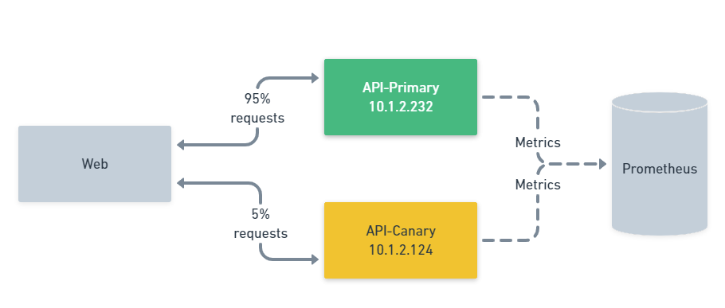
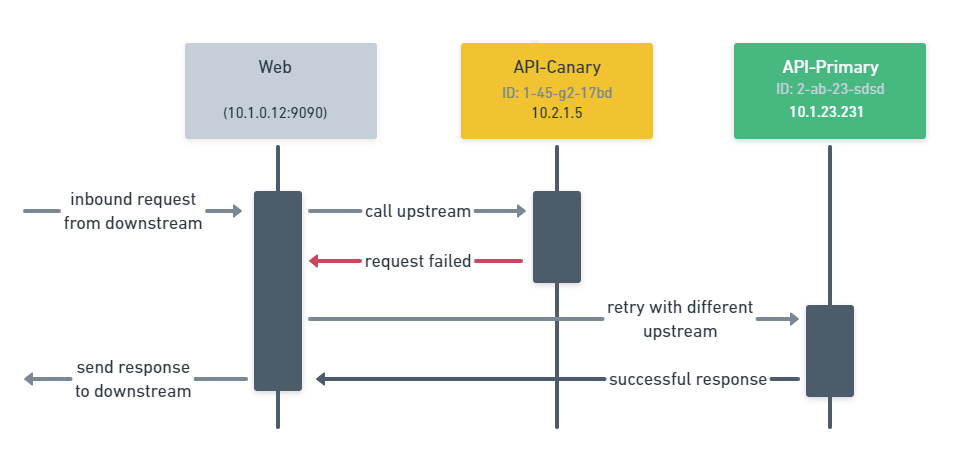
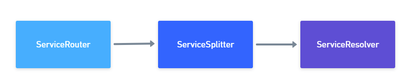

import Tabs from '@theme/Tabs';
import TabItem from '@theme/TabItem'

<Tabs
  className="unique-tabs"
  groupId="environment"
  defaultValue="shipyard"
  values={[
    {label: 'Shipyard', value: 'shipyard'},
    {label: 'External Cluster', value: 'external'},
  ]}>

  </Tabs>

In this tutorial you will see how you can deploy an application using a technique called a Canary Deployment. Rather than deploying
an application and immediately routing traffic to it as soon as it is healthy. You gradually introduce traffic while monitoring for
errors. If the new version of the application is behaving correctly then the traffic is increased, if it is not then the Canary is 
removed from the production environment and traffic reverted to the original version.

Typically, this is coupled with a Retry, should the Canary deployment be faulty then the Retry will ensure that the system
calls the existing version (Primary) abstracting the end user from any errors. 

## Configuration entries

Consul Service Mesh has all the capabilities you need in order to enable canary deployment of applications. You can leverage the
Service Mesh Configuration Entries to control your applications traffic. For a Canary deployment you would create the following
configuration entries.

* **ServiceRouter** - Allows the configuration of a Retry to an upstream service
* **ServiceSplitter** - Allows the split of traffic bettween different services or subset of services
* **ServiceResolver** - Allows the definition of virtual services or subsets in services

To determine the destination service instance Consul uses these configuration entries. The service router configures the routing of traffic to a destination service using L7 HTTP metadata like the Path or Headers. It also allows the configuration of retries or timeouts related to the outbound request. For example, you may have a service router for the service API that applies 3 retries before failing. 

Next in the chain is the ServiceSplitter. The ServiceSplitter allows for weighted routing between multiple services or subsets of the same service, in this example you will be splitting traffic between your Canary and Primary subsets of the API service.

Finally the Consul uses a ServiceResolver to define the different subsets in a service. In this example you will configure two 
subsets api-primary and api-canary. Selection of the endpoints that make up this group can be done by writing a query that uses Consuls
service catalog.

Putting all that together you get a more detailed flow like the below example:

## Performing a Canary deployment

Once defined the ServiceRouter and ServiceResolver configurations do not need to change, to control the amount of traffic sent to either 
the Primary or the Canary you would update the ServiceSplitter configuration, monitor for errors and again update the ServiceSplitter.
This is a task which could be performed 100% manually, however it we can also codify this manual process and leverage wonderful tools 
like Flagger to do this for us.

This tutorial will walk you through all the steps needed to enable canary deployments: 

* Kubernetes Custom Resources for Consul Configuration
* Flagger configuration
* Grafana Dashboard
* Load generator
* Application Deployment

First let's start with configuring Consuls ServiceRouter and Service Resolver.